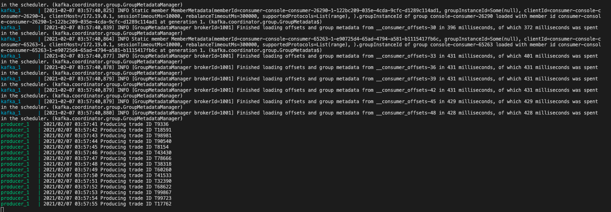
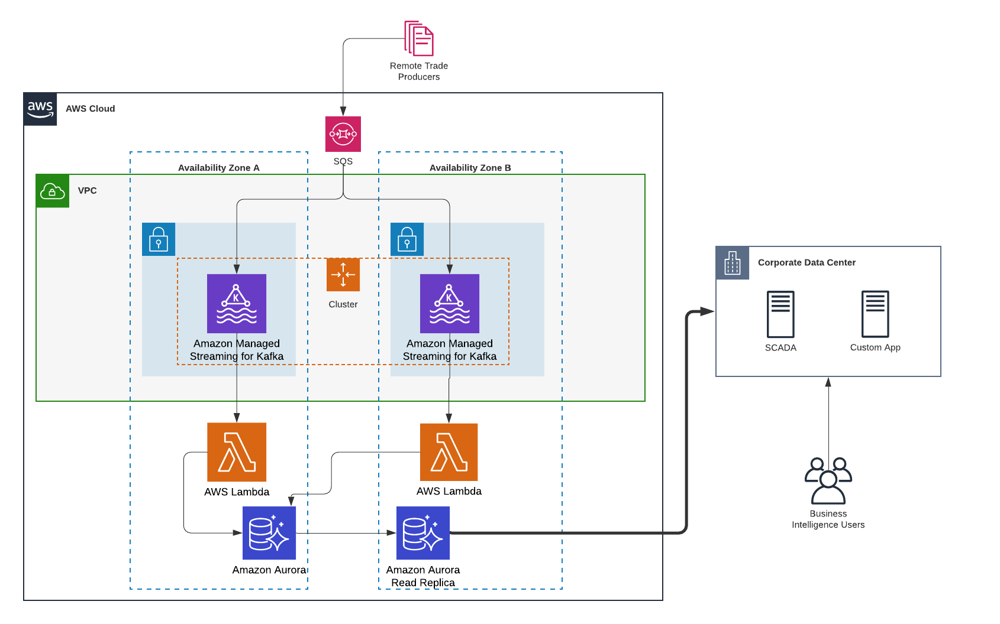

# Kafka Trades Stream

This project is a small PoC of streaming trades into a Kafka topic, reading them
from a consumer group and writing them (ensuring validation) to a postgresql database.

## Tech Stack

In order to perform a quick and lightweight setup, I used the following:

- Docker
- Docker compose
- Golang: with GORM and the sarama lib by Shopify
- PostgreSQL

Note the data is generated randomly for this simulation.

## Getting Started

The whole project has been dockerized, except for the consumer that can be run
manually and compared with the DB being populated.

For a quick start:

1. Run `docker-compose up`
2. Once the images are downloaded and running you should see the following:



3. At this point ZooKeeper, Kafka, PgSQL and the Trade Producer are up

4. We simply need to run the consumer manually in another terminal

`go run src/cmd/consumer/consumer.go -brokers 127.0.0.1:9092 -dbhost localhost`

And it will start consuming messages from Kafka and writing to the database. You will see output similar to:

```log
Stored trade with ID T47654 and version 73
Stored trade with ID T10275 and version 74
Stored trade with ID T59088 and version 48
Stored trade with ID T52848 and version 4
Stored trade with ID T2829 and version 99
Stored trade with ID T19179 and version 63
Stored trade with ID T31025 and version 42
Stored trade with ID T30526 and version 42
Stored trade with ID T71217 and version 9
Stored trade with ID T68345 and version 12
Stored trade with ID T65634 and version 76
Stored trade with ID T56500 and version 43
Stored trade with ID T44791 and version 22
```

NOTE: you might get an error such `panic: dial tcp: lookup 48c503fc8efa: no such host`, in this case just add the hostname displayed `48c503fc8efa` to your hosts file as 127.0.0.1 - It's a problem with the container networking.

## Verifying trades are written

When Docker Compose orchestrates the containers, it spawns a local PostgreSQL instance that can be reached at the following credentials:

- HOST=localhost
- USER=gorm
- PASSWORD=gorm
- DB=trades

The `trades` table will be populated with all the trades generated by the producer and processed by the consumer.

Please note the DB primary key validates duplicates and the insert function is **idempotent** to guarantee failsafe in case of duplicates.

## Testing

Due to time constraints, I managed to write only one test that ensures messages are properly serialized and deserialized into Kafka. It's located in the `./src/cmd/producer/producer_test.go` file and it can be run with the canonical:

`go test ./...`

From the main project directory.

## High level architecture

The following architecture represents a possible production deployment, it does not necessarly reflect the architecture of this PoC.




The archite

## TODO

- Better retry policy/logging when sending fails
- Use Kafka Streams to perform message validation and foward them to a "clean" topic
- Use Apache Avro to define the schema instead of pure JSON, for future maintainability
- I've assumed only Trade ID and Version are in Primary Key, but more PKs can be added by annotating the db struct
- For simplicity the number of topic partions have been limited to 1
- Write more tests for failing cases and for consumer to write to DB correctly
- Write end to end test in a proper CI flow to ensure messages are sent, received and recorded correctly